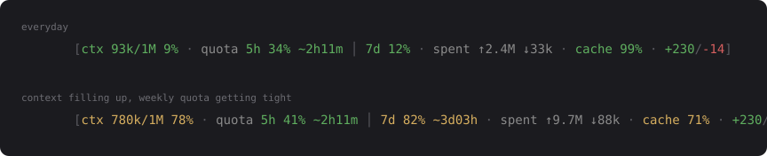

# cc-token-statusline

[](https://github.com/Alfafis/cc-token-statusline/actions/workflows/ci.yml)

Status line badge for Claude Code showing what a session is actually costing.



Colors move on their own thresholds, so the line changes shape when something
needs attention instead of reading the same at 9% and at 82%.

| Key | Label | Meaning | Source |
| --- | --- | --- | --- |
| `ctx` | `ctx` | context window used / size, colored by pressure | payload |
| `quota` | `quota` | account rate limits, 5h and 7d windows | payload |
| `tok` | `spent` | cumulative billed input / output tokens for the session | transcript |
| `cache` | `cache` | share of billed input served from cache — higher is better | transcript |
| `lines` | `+ -` | lines added / removed | payload |
| `sub` | `sub` | tokens spent by subagents (sidechain entries) — **off by default** | transcript |
| `api` | `api` | time spent waiting on the API — **off by default** | payload |
| `cost` | `$` | session cost — **off by default** | payload |

Keys are the stable identifiers used in `CC_TOKENS_SEGMENTS`; labels are only
what gets printed, and they are translated — `CC_TOKENS_LANG=pt` renders `token`,
`cota` and `gasto` instead. Keys never change with the language, so a switch
cannot break an existing config. `limits` is accepted as an alias for `quota`.

`quota` is the account rate limit, not a per-session budget: both windows are
account-wide, shared across every session and machine, and neither resets when
you start a new session. Each window is colored on its own clock, and they are
split by `│` rather than the `·` used between segments — same segment, two
readings.

Each window carries its own countdown, so a reset can never be read against the
wrong clock. The 5h one is always shown: it is the window that stops the session
you are in. The 7d one appears only once that window passes 70%, because a reset
days away costs columns to say nothing you can act on until it becomes the real
ceiling.

```
[ctx 780k/1M 78% · quota 5h 41% ~2h11m │ 7d 82% ~3d03h · spent ↑2.4M ↓33k]
```

The segment disappears entirely when the payload carries no `rate_limits`
(API-key accounts do not have them).

Three segments are off by default, for one shared reason: the badge is there to
tell you whether you can keep going, and none of them answers that.

- `cost` reports 0 on subscription plans in some setups, and the columns it takes
  are better spent on both quota windows — the quota is what actually limits the
  day.
- `api` is time already spent waiting. Nothing you do next changes it.
- `sub` is a running total for work that already happened, and the badge cannot
  say whether it was worth the tokens.

None of them is gone — name any of them in `CC_TOKENS_SEGMENTS` and it comes
back, in the order you list:

```
CC_TOKENS_SEGMENTS=ctx,quota,tok,cache,sub,lines,api
```

## Install

As a plugin:

```
/plugin marketplace add Alfafis/cc-token-statusline
/plugin install cc-token-statusline@cc-token-statusline
```

Installing the plugin is not enough on its own. Claude Code reads `statusLine`
only from `settings.json`, and no plugin can register one — so the first session
after install offers to run the wiring for you. Say yes once and it is done.

Standalone, or to do the wiring yourself:

```bash
python3 scripts/install.py       # python scripts/install.py on Windows
```

It copies the badge into `~/.claude/hooks` and points `statusLine` at it,
backing up every file it edits. It also records which version the copy came from,
so the SessionStart hook can tell a plugin that is ahead of the copy — worth a
refresh — from a copy that is ahead of the plugin, which is what a checkout looks
like and needs no advice.

The wired command names the interpreter by absolute path:

```json
"statusLine": { "command": "\"/usr/bin/python3\" \"/home/me/.claude/hooks/tokens_statusline.py\"" }
```

No shell, no `bash`, no guessing whether this machine calls it `python` or
`python3` — which matters, because a stock Windows install has neither `bash`
nor a `python3.exe`, and a `statusLine` command that fails hides the entire
status bar rather than just this badge.

### Already using another status line

Claude Code allows exactly one `statusLine` command, so an existing one is
wrapped rather than replaced: it runs first, with the same payload on stdin, and
the badge is appended to whatever it prints.

```
ccusage output here  [ctx 93k/1M 9% · quota 5h 34% │ 7d 12% · cache 99%]
```

The wrapped command gets a 2 second timeout (`CC_TOKENS_CHAIN_TIMEOUT`) and its
failures are swallowed, so a slow or broken third-party status line cannot take
the badge — or the whole status bar — down with it. Under PowerShell the budget
is 4 seconds: the timeout has to cover the interpreter starting up, which costs
close to a second there and nothing under bash. Naming a number yourself sets
the whole budget, allowance included.

It also runs in the same shell Claude Code would have used: a POSIX shell on
macOS and Linux, Git Bash on Windows when Git Bash is installed, PowerShell on
Windows when it is not. `CC_TOKENS_CHAIN_SHELL` overrides the choice with
`bash`, `powershell` or `cmd`.

An existing command that already runs this badge — a combiner script calling
several badges in a row, say — is left exactly as it is: wrapping it would print
the badge twice. The installer reads what a command runs, not just what it is
named, so it only refreshes the copy in that case.

| Flag | Effect |
| --- | --- |
| `--replace` | discard the existing statusLine instead of wrapping it |
| `--uninstall` | put the previous statusLine back, or remove ours if there was none |
| `--dry-run` | print what would change |

## Configuration

All via environment variables (settable in the `env` block of `settings.json`):

| Variable | Default | Effect |
| --- | --- | --- |
| `CC_TOKENS_LANG` | `en` | label language: `en` or `pt`. Unknown values fall back to `en`. |
| `CC_TOKENS_SEGMENTS` | `ctx,quota,tok,cache,lines` | which segments, in order. Add `cost`, `sub` or `api` to get them back. |
| `CC_TOKENS_WIDTH` | terminal width − reserve | hard cap on badge width |
| `CC_TOKENS_RESERVE` | `34` | columns left for other badges |
| `CC_TOKENS_COLOR` | `1` | `0` disables color (`NO_COLOR` works too) |
| `CC_TOKENS_ASCII` | unset | `1` forces ASCII glyphs (`|`, `^`, `v`) instead of `│ ↑ ↓` |
| `CC_TOKENS_PYTHON` | autodetected | explicit python path, honored only by the legacy bash entry point |
| `CC_TOKENS_CHAIN_TIMEOUT` | `2`, `4` under PowerShell | seconds allowed to a wrapped status line command, its interpreter's startup included |
| `CC_TOKENS_CHAIN_SHELL` | autodetected | shell used for a wrapped command: `bash`, `powershell` or `cmd` |
| `CC_TOKENS_DEBUG` | unset | raise errors instead of printing nothing |

When the badge does not fit, segments are dropped in this order — the
off-by-default names included, since turning one on does not spare it:

```
api → lines → sub → tok → cache → cost → quota → ctx
```

`cache` outranks `tok` on purpose — a hit rate is actionable, a running total is
a scoreboard. `ctx` and `quota` answer "can I keep going", so they die last.

## Full breakdown

```bash
python3 ~/.claude/hooks/tokens_statusline.py --report <transcript.jsonl>
```

Also available as the `/token-report` command when installed as a plugin.

The report ends with both quota windows and the time left on each. Claude Code
sends `rate_limits` on the status line's stdin and nowhere else, so a report run
from a terminal has no live copy: the badge records what it last saw in
`~/.claude/statusline-cache/quota.json` and the report reads that. The
percentages are therefore a snapshot, and the report says how old it is whenever
it is worth saying. The countdowns are not a snapshot — `resets_at` is an
absolute instant, recomputed at print time — so they are right however long ago
the badge last rendered.

## How it works

The status line command receives a JSON payload on stdin containing
`context_window`, `cost`, `model`, `rate_limits` and `transcript_path`. Context,
cost, line counts and API time come straight from it.

Cumulative tokens, cache hit rate and subagent spend are not in the payload, so
the session transcript is parsed. Two things matter there:

* **Deduplication.** Assistant entries repeat once per streamed content block,
  each copy carrying the full `usage` object. Summing them blindly overcounts by
  2–3x. Every request is counted once, keyed by `requestId`.
* **Incremental reads.** The status line re-renders constantly, so the parse is
  resumable: byte offset and running totals are cached per session under
  `~/.claude/statusline-cache/`, and only new bytes are read. A trailing partial
  line is left for the next run, since Claude Code appends while rendering.

Cold start on a transcript over 32 MB reads only the last 8 MB and marks the
token segment with `~` — the totals are then a floor, not a total.

Any error prints nothing and exits 0. A non-zero exit hides the whole status bar.

## Development

```
.claude-plugin/     plugin and marketplace manifests
scripts/            the badge, the installer and the SessionStart check
hooks/              hooks.json only
commands/           /token-report
tests/              python3 tests/run.py — no dependencies beyond the stdlib
```

`python3 tests/run.py` covers the parts that are easy to get quietly wrong:
deduplication, incremental parsing against a one-shot parse, resuming from a
half-written line, quota window selection, width trimming, and every failure
mode printing nothing with exit 0. It runs against a throwaway
`CLAUDE_CONFIG_DIR`, so the real cache is untouched.

CI runs it on Linux, macOS and Windows. Windows is in the matrix because every
portability bug this project has had was a shell assumption that no Unix runner
could catch.

## Limitations

* `total_cost_usd` is 0 on subscription plans in some setups. The `cost` segment
  is off by default for that reason, and hides itself rather than showing a
  permanent `$0.00` when enabled.
* The cache directory holds one small file per session; files untouched for 30
  days are deleted the next time a new session appears.
* The status line runs a copy under `~/.claude/hooks`, not the plugin's own
  files — a plugin path carries a version hash and would break on every update.
  So `plugin update` does not reach the badge; the SessionStart hook notices the
  drift and offers to re-run the installer.
* Terminal width comes from the first terminal in reach: stderr, stdout, stdin,
  then the console device itself (`/dev/tty`, `CONOUT$` on Windows). `COLUMNS` is
  used only when none of those is a terminal, and 80 columns is the last resort.
  Set `CC_TOKENS_WIDTH` to pin it.
* Consoles that cannot encode the box-drawing and arrow glyphs (Windows `cp1252`)
  get the ASCII set automatically. Output is written as UTF-8 regardless.
